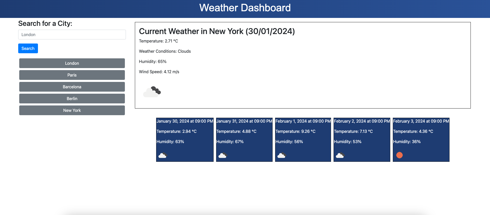

# Weather Dashboard

## Objective
Create an interactive weather dashboard using Bootstrap for styling, jQuery for dynamic updates, and Day.js for real-time date handling. This application integrates OpenWeatherMap's APIs to fetch current and forecasted weather data.

## Goal
The application delivers an interface to view current weather conditions and a 5-day forecast for any city. It features dynamic updates of weather details including temperature, humidity, and wind speed. The dashboard uses local storage for persisting user's search history and Day.js to recall todays date.

## Preview

## Deployment
Visit the Live Application [here](https://calebtkjordan.github.io/weather-dashboard/) 

